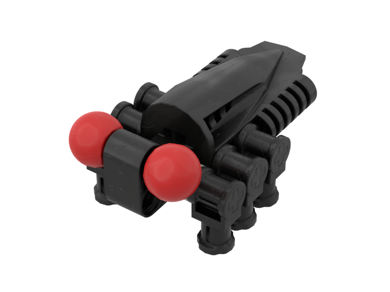

Notes
-----
* Comes in black and blue
* In LOMN, a Tohunga asks Onua to find his pet bug named Thali-Whali which is a blue version of this bug. The Tohunga indicates the bug is male. https://www.youtube.com/watch?v=nVJZiQnkoTc&t=2m21s