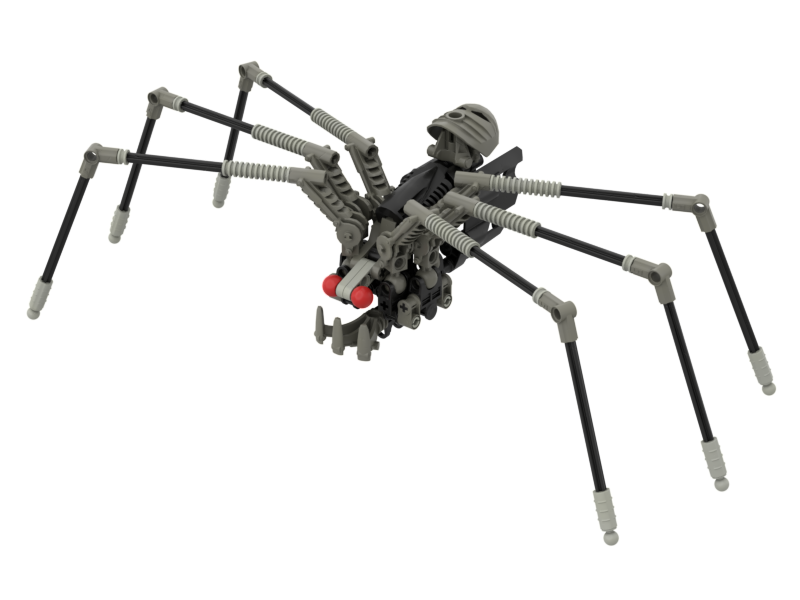

Notes
-----
* In the LOMN model, the axles on the upper legs appear to be 14 or 16 long. However such axles were not produced until 2004 so we have chosen 12 long axles
* There is a dark gray ball stud on the bottom of the model. It is our belief this came from the modelers copying the leg attachment points and neglecting to remove this piece so we have omitted it
* On the bottom of the abdomen there is a place where two 1x4 thin liftarms are necessary to hold the model together. These are not present in the LOMN model which we assume is due to the modeler omitting it