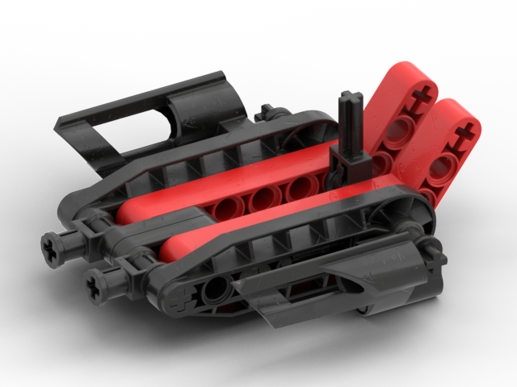

Versions
--------
| Version | Appears In |
|-|-|
| Green and black lavaboard | LoMN, MNOG |
| Red and black lavaboard | MNOG |
| Red and yellow lavaboard | QftT |

Notes
-----
* This build is primarily based on the lavaboard's depiction in QftT and LoMN. The MNOG features the same lavaboard but omits certain pieces such as thin 1x3 liftarms near the front
* This build can be created with just pieces from the Master Builder Set except for the the piece sticking up near the rear of the board

Tasks
-----
* Find LoMN model to archive with this repository
    * Investigate whether to add half technic bushings to the back based on LOMN model