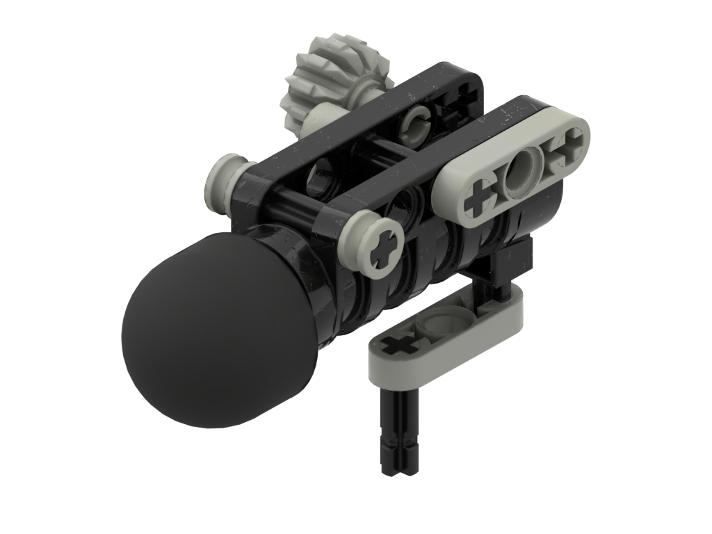

Versions
--------
| Version | Appears In |
|-|-|
| Black and light gray | LoMN |
| Blue, yellow, and red | QftT |

Notes
-----
* Not sure if the bushings at the front should be half a stud or a full stud
* In QftT there is a 1x3 thin liftarm opposing the side with gears. This is not present in the LoMN model which instead appears to have the same piece attached to the trigger. We suspect that the piece was moved by one of the game teams and are not sure which model is more accurate to the original intention.