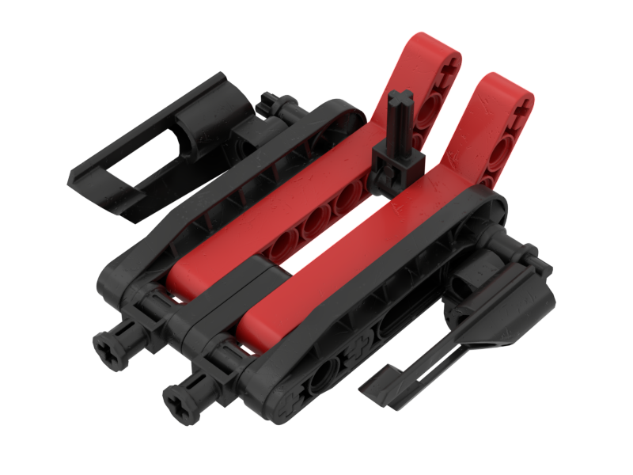

Notes
-----
* This build is primarily based on the lavaboard's depiction in QFTT and LOMN. The MNOG features the same lavaboard but omits certain pieces such as thin 1x3 liftarms near the front

Tasks
* Consider replacing the two thin 1x3 liftarms with a single liftarm if that would be more accurate to QFTT