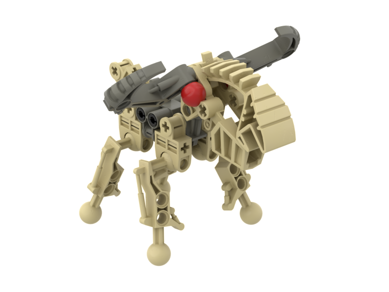

Notes
-----
* Lego never mass produced the Toa Mata foot in tan. However in 2008, a similar mold with a flat top was produced in tan for Vorox. Many fans use that piece to build Mahi.
* The leg piece is a single mold and is thus only produced in a single color. However  MNOG shows grey ball joints on the leg piece. We interpret this as artistic liberty taken by Templar artists and are assuming the actual color was tan because the majority of the leg is depicted as tan.