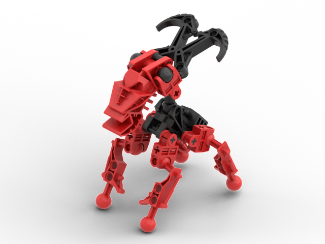

Versions
--------
| Version |  Head & Leg Color | Body & Horn Color | Appears In |
|-|-|-|-|
| Fire Mahi | Orange | Red | QftT |
| Unnamed | Red | Black | QftT |
| Unnamed | Purple | Dark Gray | QftT |

Notes
-----
* Only the red Mahi can be built as Tohunga arms were not produced in orange or purple
* The angled connector is depicted at multiple angles; we chose the angle which we thought it appears in most commonly