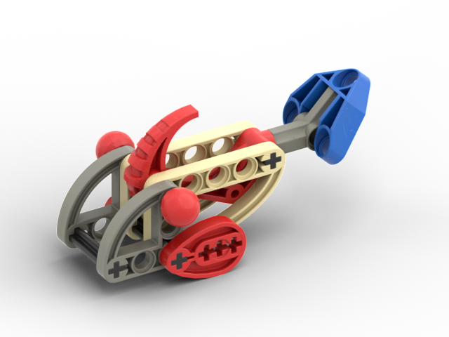

Versions
--------
| Version | Description | Appears In |
|-|-|-|
| Unnamed | Dark gray head, red eyes, red front fins, tan body, dark gray rear, blue tail fin | LoMN |
| Unnamed | Dark gray head, red eyes, red front fins, tan body, blue rear & tail fin | MNOG |
| Unnamed | Dark gray head, red eyes, red front fins, tan body, dark gray rear & tail fin | MNOG |
| Unnamed | Green with red eyes | QftM |
| Unnamed | Light blue with red eyes | QftM |
| Unnamed | Entirely reds | QftM |

Notes
-----
* We suspect LoMN colors are closer to the original model than MNOG based on experience comparing known game models (e.g. Tarakava) to their actual colors.
* Technic cams exist in red but are rare. It is unknown what they were produced for. The 3x5 liftarms do not exist in tan.