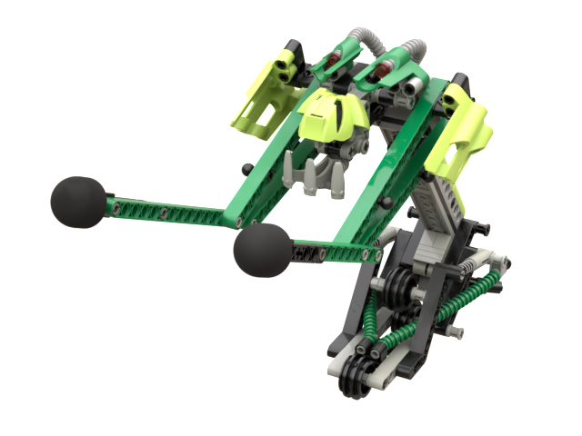

Build
-----
The following pieces were never mass produced in these colors:
* [Kakama](https://www.bricklink.com/v2/catalog/catalogitem.page?P=32568#T=S&O={%22iconly%22:0}) in neon green
* Shoulder pieces ([side A](https://www.bricklink.com/v2/catalog/catalogitem.page?P=32190#T=S&O={%22iconly%22:0}), [side B](https://www.bricklink.com/v2/catalog/catalogitem.page?P=32191#T=S&O={%22iconly%22:0})) in neon green
* [Claw](https://www.bricklink.com/v2/catalog/catalogitem.page?P=32506#T=S&O={%22iconly%22:0}) in light gray
* The projectile arrow pieces with Teal rubber tips

Notes
-----
* Need to validate length of hoses at base
* Other than color differences, the following build differences between this and the Sand Tarakava can be observed:
    * Shoulder pieces are switched
    * Rubber band pins are placed on the outside of the arms rather than the inside
    * Bushings are replaced with axle and pin connectors to hold tubes connecting to behind the front wheel
    * Bushings are added to the rear wheel axle

* [Slope, Curved 2 x 4 Double without Groove](https://www.bricklink.com/v2/catalog/catalogitem.page?P=6192a#T=S&C=34&O={%22color%22:%2234%22,%22iconly%22:0}) is not in the database so the variation with groove is used instead
* The Stud.io file is missing [Duplo tread](https://www.bricklink.com/v2/catalog/catalogitem.page?id=55649#T=S&C=11&O={%22color%22:11,%22iconly%22:0}) and [rubber bands](https://www.bricklink.com/v2/catalog/catalogitem.page?P=x71#T=S&C=1&O={%22color%22:%221%22,%22iconly%22:0}) as those parts are not in the database.