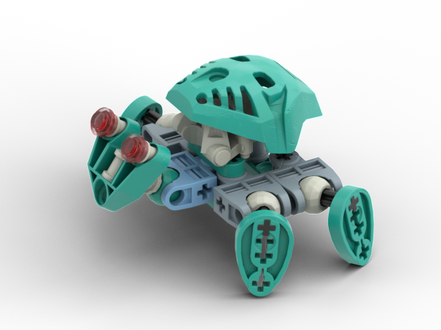

Notes
-----
* The 1x3 thin liftarm in the back does not appear be supported by anything in the LOMN model but I have taken the liberty of supporting it with 2L axles. I suspect the original model had a complimentary liftarm above and am debating whether to add it.

Tasks
-----
* Confirm the light blue color is accurate (as opposed to sand blue)
* Decide whether the head ball joint should remain turqoise as depicted or changed to light gray