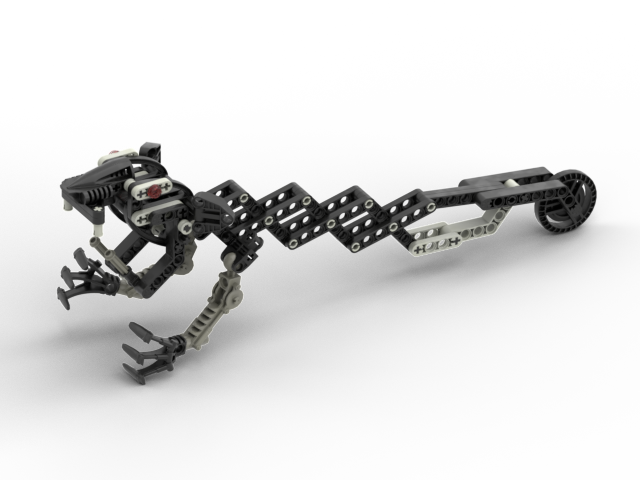

Notes
-----
* This creature has never been officially named so it is unclear whether it should be called "Wolf Rat" or "Wolfrat" based on the LOMN filename format which concatenates names without using separators
* To make the .obj match gameplay footage, I created a custom wolfrat eyes dds file and updated the MTL to point to it
* The root of the mouth uses a piece which was only released in 2002. This is close enough in time where it is plausible the designer used the piece prior to release. The alternative is to use a significantly less secure mounting for the top jaw
* The rear wheel is a mystery - it's an approximately 5x5 Technic wheel which ideally should be free spinning. The closest thing would be a Roborider wheel which was never mass produced patternless in black.

Tasks
* Confirm light gray/dark gray color choices are accurate
* Fix various small alignment issues