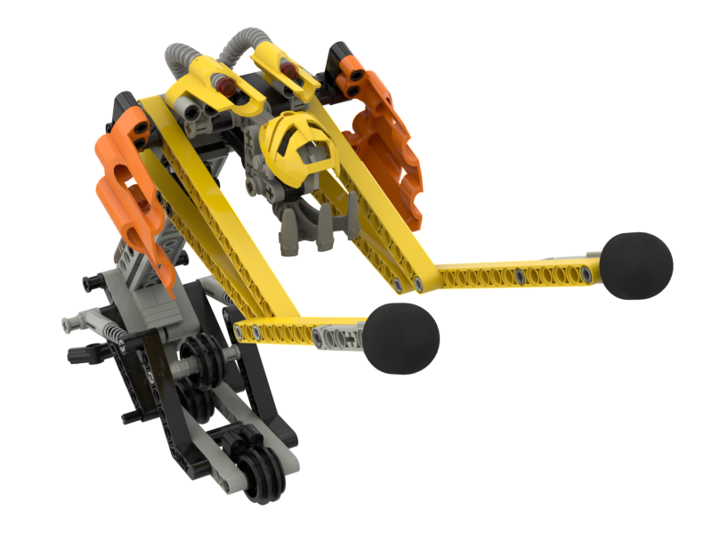

Notes
-----
* The build is primarily based on pictures provided by Mark of Mask of Destiny. In 2002 he obtained a prototype Tarakava purportedly sold on eBay by one of Templar's employees. This model bears many similarities to the MNOG Tarakava. We have also referenced the LOMN model which appears to be based on the same physical model. See [Emily's blog](https://emilyinternet.zone/weblog/2020-7-23.html) and [Matthew's blog](https://www.matthewdean.com/sand-tarakava-replica) for more information. 
* The Stud.io file is missing the [Duplo tread](https://www.bricklink.com/v2/catalog/catalogitem.page?P=x71#T=S&C=1&O={%22color%22:%221%22,%22iconly%22:0}) and [rubber bands](https://www.bricklink.com/v2/catalog/catalogitem.page?id=55649#T=S&C=11&O={%22color%22:11,%22iconly%22:0}) as those parts are not in the database.