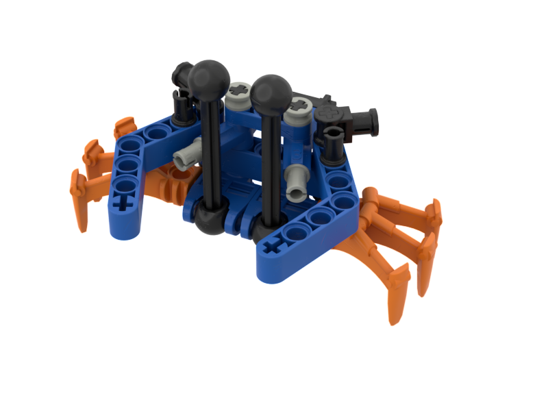
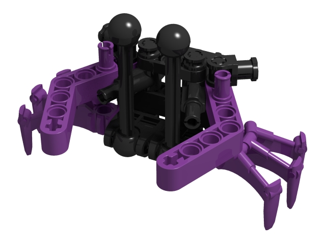
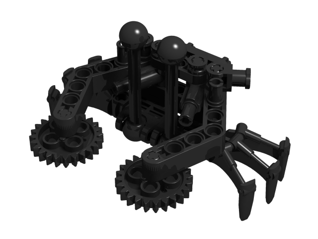

Notes
-----
* This build was officially released with the 2002 Master Builder Set. However the build was depicted in various other colors in the MNOG and Quest for the Toa game cards. And in the MNOG, there is a mining ussal which has gears on the end of its pincers.
* The Stud.io file is lacking rubber bands as they are not in the database.

Tasks
-----
* Change all axles & connectors to use colors which were generally used at the time
* Confirm the eye stalks are 6L