bio-media-builds
================

Mission
-------
Create and preserve digital representations of buildable models present in BIONICLE media. Note that LEGO and BIONICLE are trademarks of the LEGO Group of companies which does not sponsor, authorize or endorse this project.

We prioritize builds from the early years (2001-2002) which do not have official instructions.

Values
------
* **Accuracy**: builds are consistent with what the LEGO group created at the time
  * Use only part molds which existed at the time
  * For a given part, strive to use colors in which it was produced. You can make exceptions for parts which are significant to the model as Lego did produce parts in novel colors for prototyping
* **Reproducability**: anyone can quickly verify the accuracy of a build
  * Store any referenced materials (3D models, screenshots) in this repository
* **Openness**: anyone can contribute missing builds, suggest alterations, and flag inaccuracies

Contributing
------------
Read our [Contribution Guidelines](contributing.md) to learn how you can help with this project.

Builds
------

### Rahi
| Image | Name | Appears In |
|-|-|-|
| 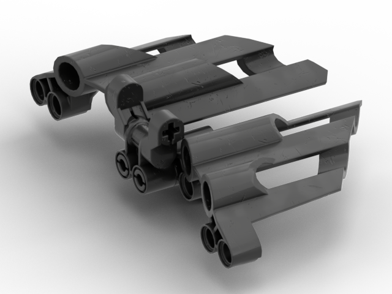 | [Bat](/builds/rahi/bat) | LoMN, QftM |
|  | Bird | LoMN, QftT |
| 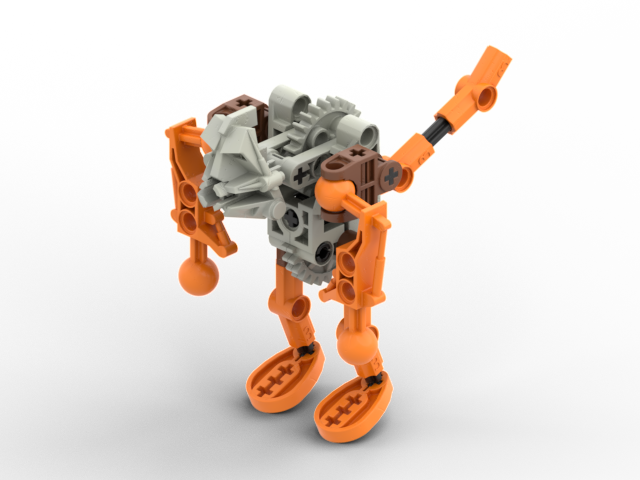 | [Brakas](/builds/rahi/brakas) | QftT (scrapped) |
| 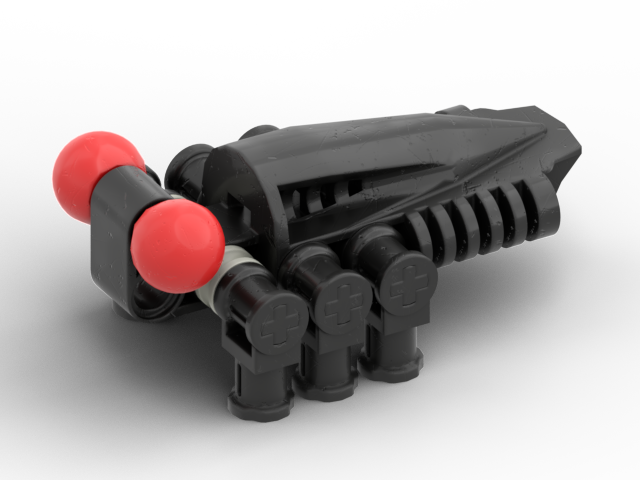 | [Bug](/builds/rahi/bug) | LoMN, QftT |  Black, Light Blue |
|  | Cliff Bug | QftT |
| 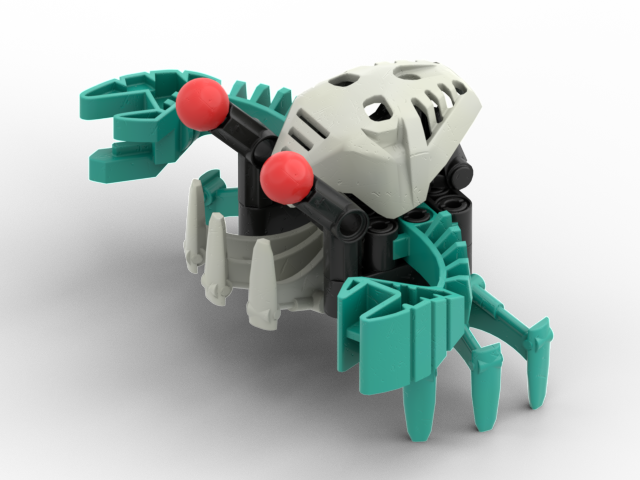 | [Crab](/builds/rahi/crab) | LoMN | |
| 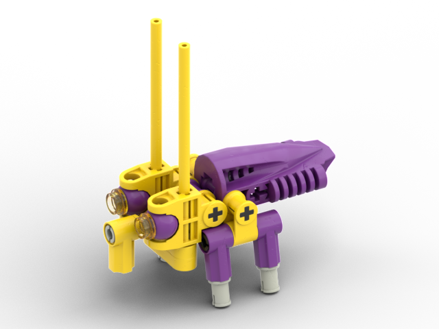 | [Electric Bug](/builds/rahi/electric-bug) | LoMN, QftT |
|  | [Electric Spider](/builds/rahi/electric-spider) | QftT |
|  | [Fikou Nui](/builds/rahi/fikou-nui) | LoMN | |
|  | Husi | QftT
| 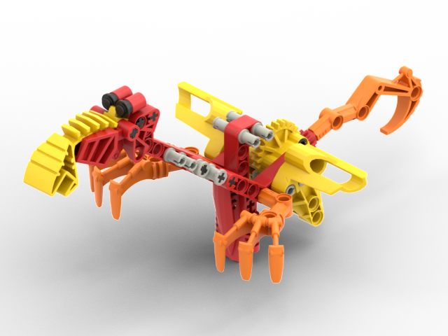 | [Hikaki (QftT)](/builds/rahi/hikaki) | QftT
| | Kewa | MNOG, QftT |
|  | Kofo-Jaga | QftT
| 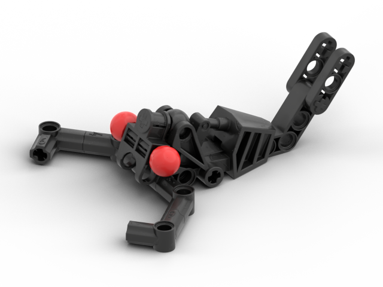 | [Little Scorpion](/builds/rahi/little-scorpion) | LoMN, QftT |
| 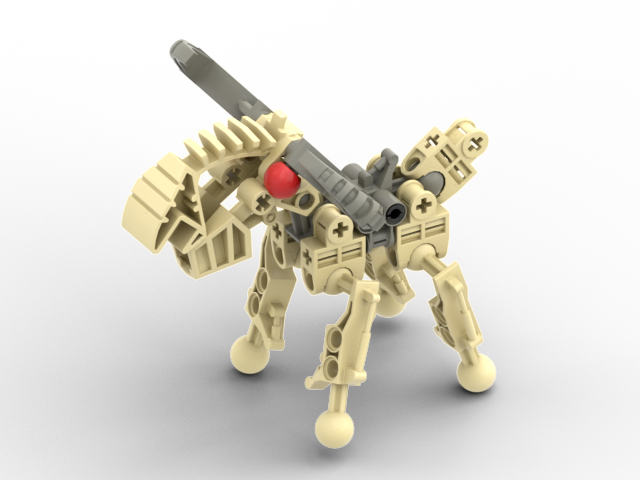 | [Mahi (Tame)](/builds/rahi/mahi-tame) | MNOG, MNOGII | |
| 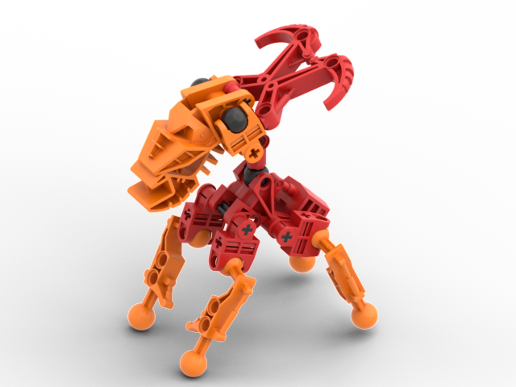 | [Mahi (Wild)](/builds/rahi/mahi-wild) | QftT |
|  | Makika | QftT
|  | Moa | QftT
| 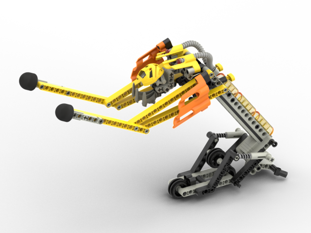 | [Sand Tarakava](/builds/rahi/sand-tarakava) | MNOG, LoMN |
| 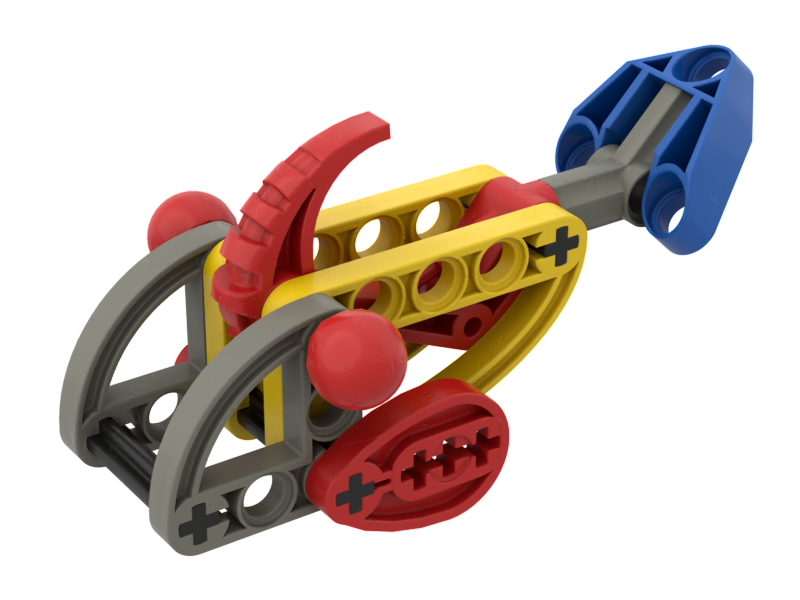 | [Small Fish](/builds/rahi/small-fish) | MNOG, LoMN, QftM
| 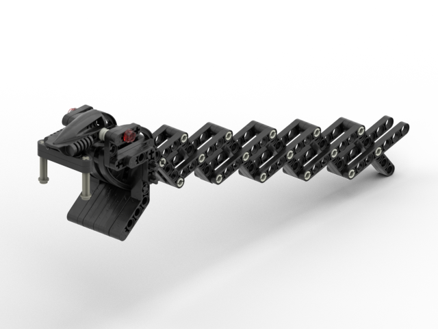 | [Snake](/builds/rahi/snake) | LoMN
|  | Taki | QftT
| 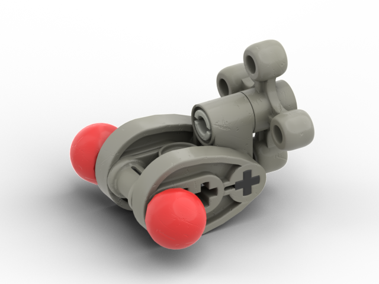 | [Tiny Fish](/builds/rahi/tiny-fish) | LoMN, QftM |
| 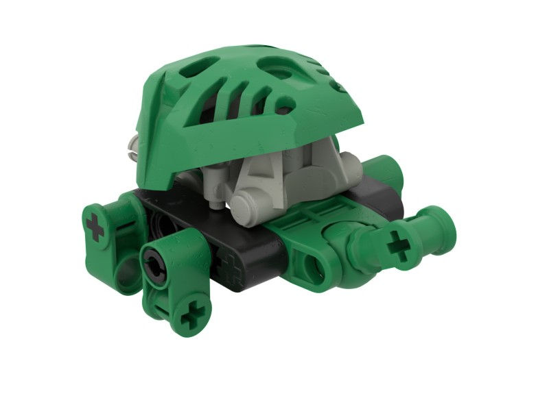 | [Shore Turtle](/builds/rahi/shore-turtle) | LoMN (scrapped), QftT, QftM |
| 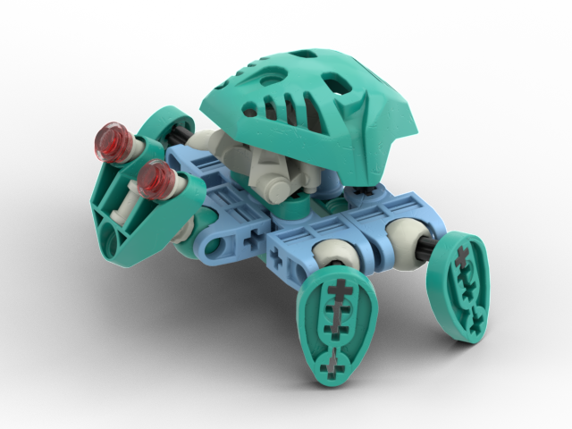 | [Turtle](/builds/rahi/turtle) | LoMN
| 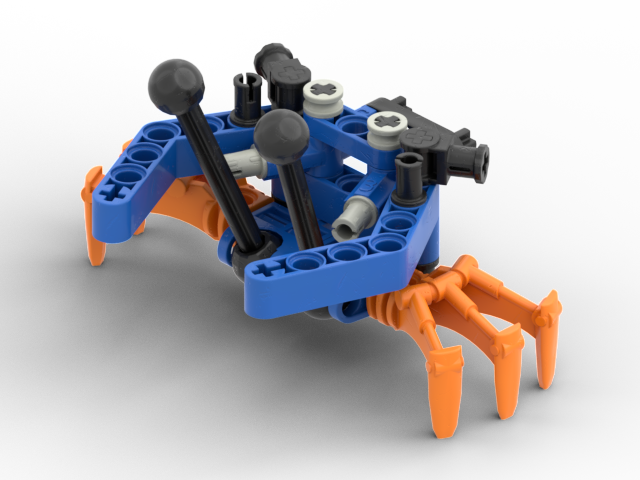 | [Ussal Crab](/builds/rahi/ussal-crab) | MNOG, QftT, QftM |
|  | Vako | QftT
| 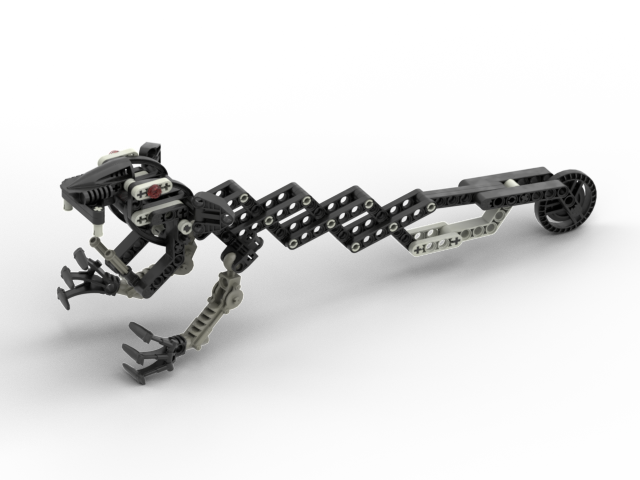 | [Wolf Rat](/builds/rahi/wolf-rat) | LoMN

### Items
| Image | Name | Appears In |
|-|-|-|
| 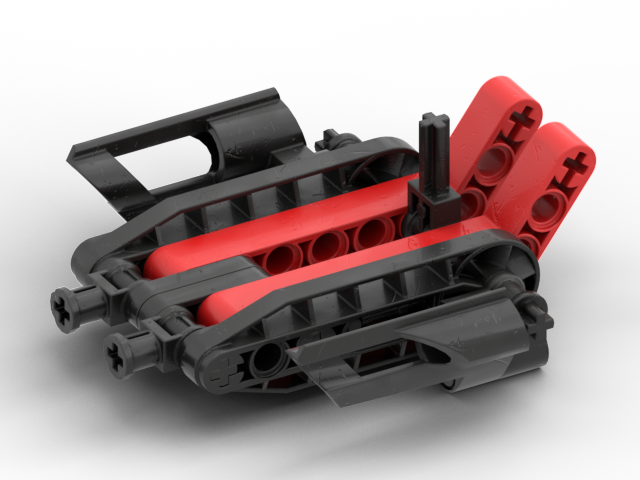 | [Lavaboard](/builds/items/lavaboard) | MNOG, LoMN, QftT |
| | Volo Lutu Launcher | LoMN, QftT
| | Vuata Maca Crystal | QftT
| | Vuata Maca Tree | QftT
| 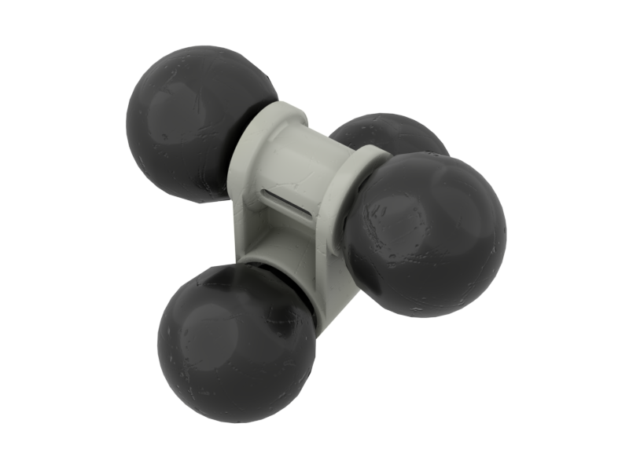 | [Vuata Maca Tree Fruit](/builds/items/vuata-maca-tree-fruit) | MNOG, LoMN

### Dark Hunters
| Image | Name | Appears In |
|-|-|-|
| 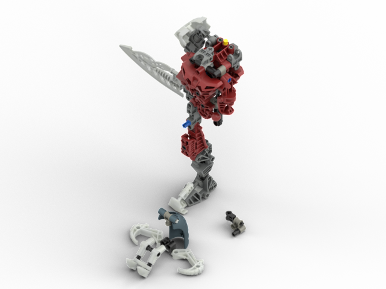 | [Charger](/builds/dark-hunters/charger) | DH |

### Media
| Media | Acronym | Medium | Year Released |
|-|-|-|-|
| [Mata Nui Online Game](https://biosector01.com/wiki/Mata_Nui_Online_Game) | MNOG | Browser game | 2001 |
| [Quest for the Toa](https://biosector01.com/wiki/BIONICLE:_Quest_for_the_Toa) | QftT | PC game | 2001 |
| [The Legend of Mata Nui](https://biosector01.com/wiki/BIONICLE:_The_Legend_of_Mata_Nui) | LoMN | PC game | 2001 (cancelled) |
| [Quest for the Masks](https://biosector01.com/wiki/BIONICLE:_Quest_for_the_Masks) | QftM | Card game | 2001 |
| [Mata Nui Online Game II: The Final Chronicle](https://biosector01.com/wiki/Mata_Nui_Online_Game_II:_The_Final_Chronicle) | MNOGII | Browser game | 2003 |
| [Dark Hunters](https://biosector01.com/wiki/BIONICLE:_Dark_Hunters) | DH | Book | 2006 |

Credits
-------
* The [LEGO Group](https://www.lego.com/en-us/aboutus/lego-group) for creating the immersive world of BIONICLE
* The [BioMedia Project team](http://biomediaproject.com/bmp/staff/) for thoroughly archiving and sharing their knowledge of BIONICLE media
* [Mark of Mask of Destiny](https://www.maskofdestiny.com/news/author/mark-of-mod) for publishing [pictures of his Sand Tarakava](https://www.maskofdestiny.com/news/icfta-sand-tarakava)
* [TLROsborne of DeviantArt](https://www.deviantart.com/tlrosborne/gallery/77472217/bionicle-canon-model-instructions) and [brickinui of Imgur](https://imgur.com/user/brickinui) for publishing instructions of various models which we cross-referenced
* [Boxturret](https://boxturret.tumblr.com/tagged/3D) for their inspirational 3D renders
* [Emily](https://emilyinternet.zone/) for tips on reconstructing various Rahi
* jointdog for painstakingly ripping and publishing [spritesheets of QftT](https://www.spriters-resource.com/game_boy_advance/bioniclequestforthetoa/)